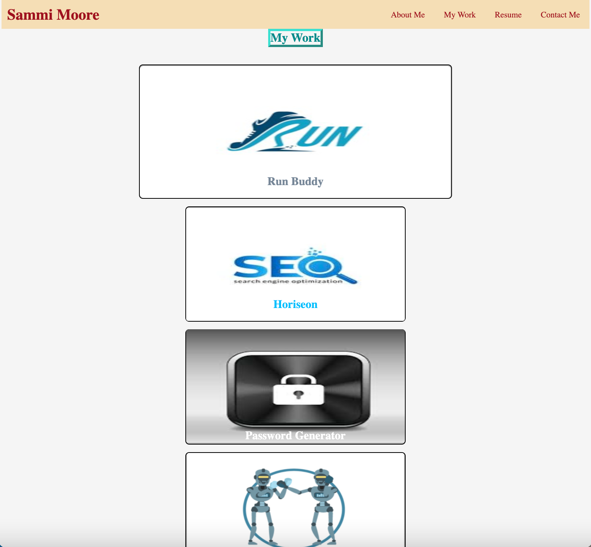

# Description
The goal of this project was to design a responsive and creative professional portfolio to showcase my prior and future coding projects. This professional portfolio is meant to provide potential employers with information about myself and the coding work I have conducted. The purpose of creating this professional portfolio webpage is to have a space where I can easily organize, update, and present projects I have created. 

This portfolio webpage is accessible and contains navigation links, images, and contact information. It was designed to be user-friendly and allow for effortless navigation and discovery. 

# Table of Contents
- [Built With](#built-with)
- [Navigation Links](#navigation-links)
- [Preview](#preview)
- [Portfolio Link](#portfolio-link)
- [Credit](#credit)
- [Contribution](#contribution)

# Built With
This professional portfolio was created using:
- HTML
- CSS

# Navigation Links
The portfolio webpage has several navigation links that the visitor should be aware of:
- The header contains an About Me, My Work, Resume, and Contact Me section that each link to their corresponding section within the page
- The "My Work" section contains images with project titles that allow the visitor to click on the image, which will send them to the deployed application
- The "Resume" section has a button link that will send the visitor to my current resume
- The "Contact Me" section has an email link, phone number link, and a GitHub link

# Preview
Below are several screenshots providing an overview of the professional portfolio webpage:
  

# Portfolio Link
The link to my professional portfolio is:
 
https://sm3131.github.io/professional-portfolio/

# Credit
Besides the portrait images, the images used on this webpage were pulled from google images. 
- The hero image is a landscape of red rock national park credited to: https://www.explore-share.com/trip/rock-climbing-half-day-program-red-rock-nevada/
- The RUN logo image can be credited to: https://www.shutterstock.com/search/running+logo
- The SEO logo image can be credited to: https://www.vecteezy.com/free-vector/logo-seo
- The lock image can be credited to: https://www.vectorstock.com/royalty-free-vector/blue-lock-icon-with-protection-key-password-blocke-vector-4059388
- The robot/gladiators image can be credited to: https://courses.bootcampspot.com/courses/969
- The institute of coding image can be credited to: https://wearetechwomen.com/join-the-women-in-tech-revolution/institute-of-coding-logo-featured/
- The weekly calender image can be credited to: https://www.picmonkey.com/templates/calendar/daily/daily-work-schedule-3300x2550

# Contribution

The creation of this professional portfolio was completed by myself, Sammi Moore. I worked individually on this project to design a creative and functioning webpage that showcases my coding work and provides information about myself. 

